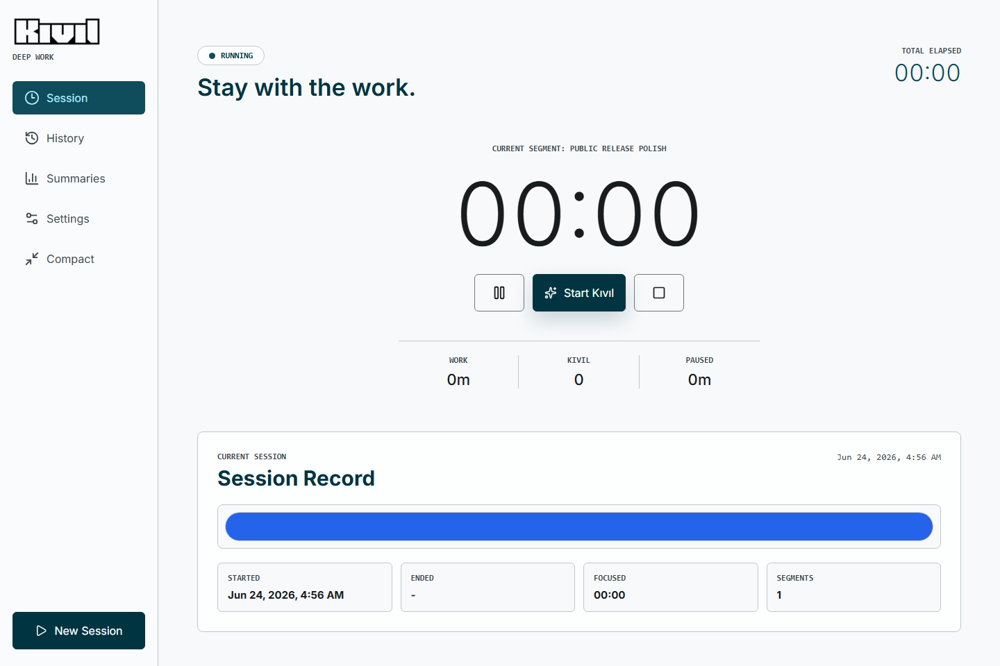
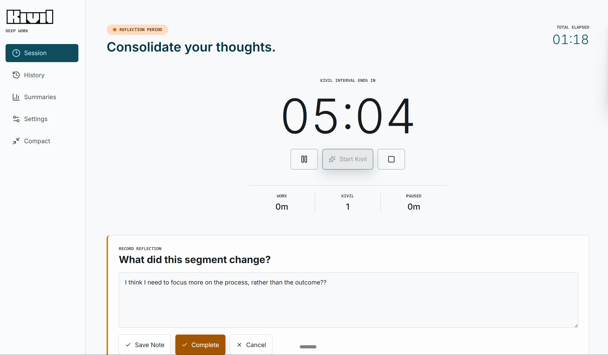
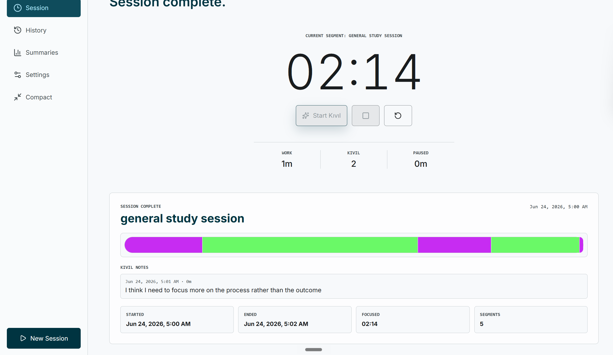
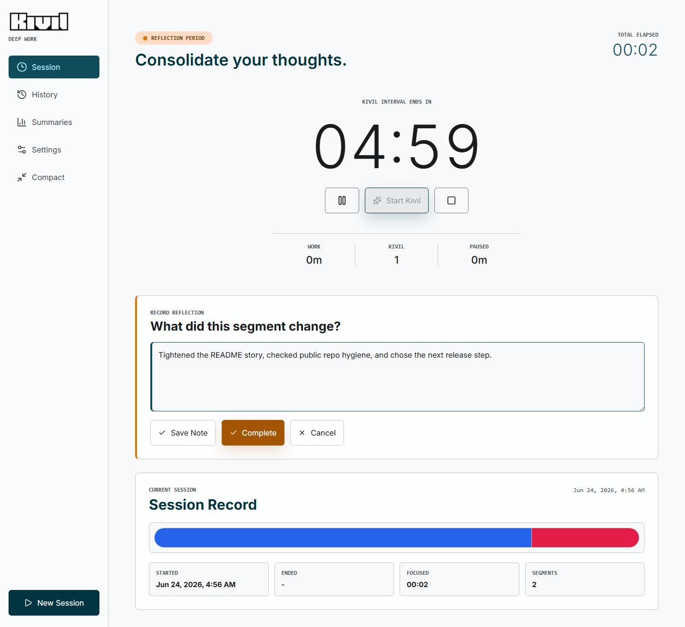
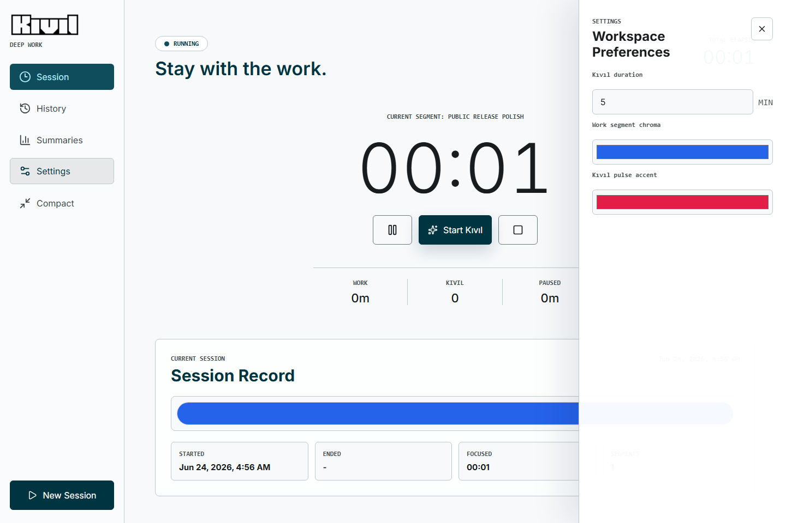
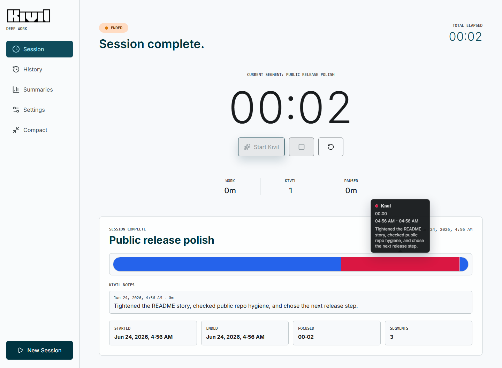

# Kıvıl

Kıvıl is a local-first desktop focus app for open-ended work sessions and intentional reflection intervals.

It is not a Pomodoro timer. A Kıvıl session starts like a stopwatch and keeps the work timeline open until the user ends it. During that session, the user can start short Kıvıl intervals: timed reflection periods used to regroup, review what changed, notice friction, and choose the next useful move. These intervals are part of the work record, not breaks.

## Screenshots













## Why This Exists

Fixed cycles work well for some tasks, but many real work sessions do not fit neatly into 25-minute blocks. Kıvıl is designed for open-ended thinking, debugging, writing, design, and implementation work where momentum matters but periodic awareness still helps.

The core idea is simple:

- The main timer counts upward from zero.
- The session ends only when the user decides the work is done.
- Reflection intervals can be inserted manually at any point.
- Reflection is treated as part of the session, not as rest.
- The final record shows what happened chronologically.

## Features

- Open-ended session timer.
- Pause and resume.
- Manual Kıvıl reflection intervals.
- Countdown timer during active Kıvıl intervals.
- Optional reflection notes.
- Local session persistence with `localStorage`.
- Saved session history with rename, open, and delete actions.
- Summary view with chronological segment timelines.
- Custom work and Kıvıl segment colors.
- Compact always-on-top desktop mode through Neutralinojs window APIs.

## Tech Stack

- React
- TypeScript
- Vite
- Neutralinojs desktop shell
- Vitest
- Playwright

The session engine is event-log based: timers, summaries, saved sessions, and timelines are derived from chronological events instead of manually mutated counters.

## Getting Started

```bash
npm install
npm run dev
```

Open `http://127.0.0.1:5173/` for the web development build.

## Desktop Commands

```bash
npm run desktop:run
npm run desktop:build
```

Kıvıl currently uses Neutralinojs because it provides a lightweight desktop shell without requiring the Rust and Microsoft C++ Build Tools setup that Tauri requires on Windows.

## Verification

```bash
npm test
npm run lint
npm run build
npm run test:smoke
```

## Project Structure

- `src/domain`: Event-log session model, snapshot derivation, tests, and persistence helpers.
- `src/components`: React UI components.
- `src/utils`: Timer formatting and desktop window helpers.
- `tests`: Playwright smoke tests.
- `assets/brand`: Public brand and app icon assets.
- `assets/screenshots`: Public README screenshots.
- `docs`: Local planning, memory, and AI work files. This directory is intentionally ignored by git.

## Privacy And Security

- Kıvıl is local-first.
- Session data is stored in browser or desktop `localStorage`.
- The app does not include analytics, remote sync, account login, or external API calls.
- Neutralino native access is limited to the window methods required for compact mode.
- Neutralino token security is configured as `one-time`.
- Local logs, build output, generated archives, test artifacts, and private project notes are ignored by git.

## Contributing

This is a personal product prototype published for visibility and iteration. Small issues and focused pull requests are welcome, especially around reliability, packaging, accessibility, and test coverage.

Before opening a broad redesign or architecture change, please start with an issue so the product model stays coherent: Kıvıl should remain an open-ended work timeline with reflection intervals, not a Pomodoro clone.
